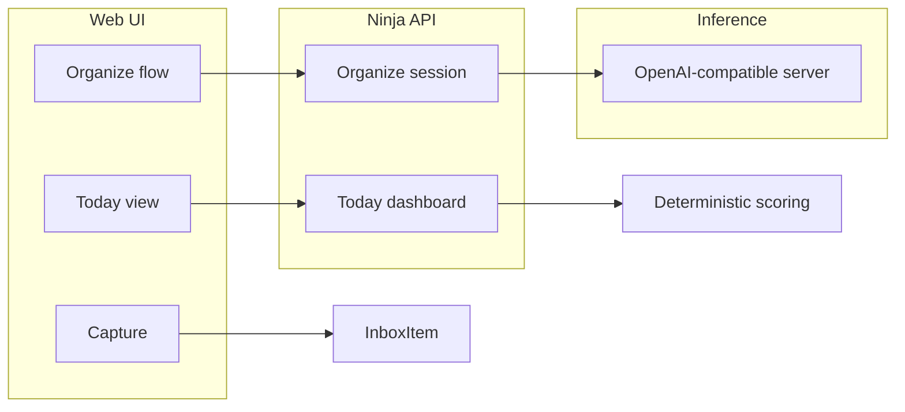

# MindFlow Projects — iterative build plan

**Source**: Working copy of the phased roadmap (aligned with [PRD.md](PRD.md)).  
**Last updated**: 2026-05-02 — Phase 1 delivered; Phase 2+ not started.

---

## Where we are now

| Phase | Status | Notes |
|-------|--------|--------|
| **1** — Domain model + admin + model tests | **Done** | Models, migrations through `0003_task_brain_space_and_remove_friction`, Unfold admin, [`mindflow/test_domain_models.py`](../mindflow/test_domain_models.py). |
| **2** — Config + AI/inference hygiene | Not started | |
| **3** — Today APIs + scoring | Not started | |
| **4** — App shell + Today UI | Not started | |
| **5** — Capture + organize UI | Not started | |
| **6** — Projects + Weekly Reset | Not started | |
| **7** — Calendar + Google two-way sync | Not started | |

### Completed work (Phase 1 summary)

- **Models** in [`mindflow/models.py`](../mindflow/models.py): `Area`, `Project` (+ optional `area`), `Milestone`, `Tag` (M2M on `Task`), extended `Task` (energy, brain space, duration, tiny step, dates, blocked/waiting, tags, milestone), `Routine`, `TimeBlock` (check constraint `end_at > start_at`), `CapacitySignal`, plus existing inbox/organize models.
- **Migrations**: `0002_phase1_domain_models`, `0003_task_brain_space_and_remove_friction`.
- **Admin**: [`mindflow/admin.py`](../mindflow/admin.py) uses `unfold.admin.ModelAdmin`; new models registered; task/project admins enriched.
- **Tests**: [`mindflow/test_domain_models.py`](../mindflow/test_domain_models.py); full suite via `python manage.py test mindflow`.

### Adjustments after the original Phase 1 write-up

- **Brain space** on `Task` (and optional `CapacitySignal`) uses cognitive **modes**, not low/medium/high: **Admin**, **Creative**, **Social**, **Quick fix**, **Hyperfocus** (stored values include `quick-fix`, `hyperfocus`, etc.). Default on new tasks: **Quick fix**.
- **Friction level** was removed from the domain model (PRD listed it; product direction chose to drop it).
- Legacy `low` / `medium` / `high` brain-space values in the DB were migrated (`0003`) to the new set before choice definitions changed.

**What you can do today**: Use **Django admin** to manage areas, projects, milestones, tasks (with metadata), tags, routines, time blocks, and capacity signals—no product screens beyond the starter template yet.

---

## Current baseline (trust the code)

- **Stack**: Django ~6, django-ninja, Tailwind v4 + DaisyUI under [`theme/static_src/src/styles.css`](../theme/static_src/src/styles.css), session auth + 2FA in [`config/urls.py`](../config/urls.py).
- **Backend domain**: PRD-aligned core objects are **persisted** (Phase 1). AI **organize session** remains in [`mindflow/services/organize.py`](../mindflow/services/organize.py) and [`mindflow/inference.py`](../mindflow/inference.py), configurable via [`config/settings/base.py`](../config/settings/base.py) (`AI_*`). Tests with mocked inference in [`mindflow/test_organize_api.py`](../mindflow/test_organize_api.py).
- **Still outstanding vs PRD/product vision**: Deterministic **Today** scoring + APIs, **product UI** (Today, Projects, Calendar, Capture, Weekly Reset), **Google Calendar** sync (Phase 7). [`theme/templates/base.html`](../theme/templates/base.html) remains a starter page.

**Design target**: [`screenshots/Screenshot 2026-05-02 153324.png`](screenshots/Screenshot%202026-05-02%20153324.png) — dark shell, top nav (Today, Projects, Calendar, Capture, Weekly Reset), Today groups (Must Do, Routines, Suggested Next Actions), current-energy control, right rail (Time Blocks, Quick Tip).

**AI scope**

- **Inbox sort / organize “brain”**: LLM-driven (implemented); later tighten prompts/modules with env-only tunables (Phase 2).
- **Today “Suggested Next Actions”**: Deterministic, explainable scoring (Phase 3); optional LLM for Quick Tip copy later.

Use **Context7** when you want verified django-ninja, Django 6, or Tailwind v4/DaisyUI details during implementation.

---

## Cross-cutting rules (all phases)

- **No hardcoded product thresholds**: Scoring weights and caps in Django settings via `environs` (extend [`.env.example`](../.env.example)); consume from something like [`mindflow/services/recommendation.py`](../mindflow/services/recommendation.py) once Phase 3 lands.
- **Modularity**
  - **Backend**: Thin views → services; Pydantic in [`mindflow/schemas.py`](../mindflow/schemas.py).
  - **Templates**: Composable partials under e.g. `theme/templates/mindflow/components/`.
- **Testing**: `python manage.py test` (`mindflow/test_*.py`); mock inference for CI; live Ollama for manual passes between phases.

---

## Phase 1 — Domain model for PRD core objects

**Status: complete** (see “Completed work” above).

**Goal**: Persist the PRD object set (and relationships) so later phases are data-driven.

**Originally specified**

- **Area** (user-scoped), optional link from **Project** to Area.
- **Milestone** (project-scoped, ordering, optional target date).
- Extend **Task** with PRD metadata: energy level, brain/focus level, duration estimate, context/mode tags via **`Tag`** M2M, `first_tiny_step`, due/scheduled dates, blocked/waiting flags.
- **Routine** (user-scoped `JSONField` recurrence).
- **TimeBlock** (user, start/end, title, optional task/project).
- **CapacitySignal** (timestamp + optional energy/brain).

**Admin / tests**: Unfold admin + [`mindflow/test_domain_models.py`](../mindflow/test_domain_models.py).

---

## Phase 2 — Configuration surface and AI/inference hygiene

**Goal**: Single source of truth for tunables; organize pipeline stays testable.

- Extend **settings** where needed (document in `.env.example`): e.g. optional temperature/max tokens per use-case if splitting **organize** vs **quick_tip** prompts.
- Split **system prompts** from [`mindflow/inference.py`](../mindflow/inference.py) into e.g. `mindflow/prompts/organize.py`; keep `inference.py` as transport + parsing.
- **Tests**: Organize tests remain green with mocks.

**When you pause**: Tune `.env` for local Ollama; exercise organize API against a live model.

---

## Phase 3 — Backend: Today aggregation, scoring, and read APIs

**Goal**: Machine-readable “Today” bundle matching the screenshot sections.

- User preference for session energy (and optionally “available minutes”).
- **Deterministic recommendation** service (tasks, routines, time blocks → grouped lists + scores + reason codes).
- **Ninja endpoints** (session-auth), mirroring [`mindflow/api.py`](../mindflow/api.py).

**Tests**: Golden-style scoring tests; API shape + auth tests.

---

## Phase 4 — App shell + design system + Today page (server-rendered)

**Goal**: Visual parity with the screenshot structure using modular templates.

- Replace starter [`theme/templates/base.html`](../theme/templates/base.html) with dark layout (nav, main column, right rail).
- Mindflow routes + views (login/2FA as needed).
- Partials for task cards, sections, time blocks, quick tip placeholder.
- Wire Today to Phase 3 (fetch + CSRF or HTMX).

**Tests**: Authenticated page tests.

---

## Phase 5 — Capture + Inbox organize UI (AI brain end-to-end)

**Goal**: Capture → inbox → Ollama organize → approve → tasks/projects.

- Capture screen creating `InboxItem`.
- Organize UI calling organize Ninja endpoints.
- Mocked tests + manual Ollama checklist.

---

## Phase 6 — Projects + Weekly Reset

**Goal**: Non-calendar PRD surfaces before Google complexity.

- **Projects**: Card grid with simple health/progress metrics.
- **Weekly Reset**: Guided stepper + optional capacity check-in.

---

## Phase 7 — Calendar UI + Google Calendar (two-way sync)

**Goal**: Unified calendar merging **TimeBlock**, dated tasks/routines, and **Google Calendar**, two-way sync.

### Architecture (modular)

- `mindflow/services/google_calendar/` (or similar): OAuth, API client, sync orchestration, mapping.
- **Env**: `GOOGLE_OAUTH_CLIENT_ID`, `GOOGLE_OAUTH_CLIENT_SECRET`, redirect URIs, optional poll interval—document in `.env.example`; no secrets in code.
- **Per-user** tokens stored securely; mapping rows with Google `calendarId`, event `id`, `etag`/`updated`.

### Sync

- **Inbound**: `events.list` + `syncToken`; optional `events.watch` in prod; polling in dev via settings.
- **Outbound**: `insert` / `patch` / `delete` with explicit conflict policy (e.g. last-write-wins + safe fallback).

### UI + tests

- Merged calendar view + connect/disconnect Google.
- Unit tests + mocked Google HTTP in CI; manual OAuth checklist.

Use **Context7** for Calendar API v3 + OAuth when implementing.

---

## Suggested phase order summary

| Phase | Focus | Test gate |
|-------|--------|-----------|
| 1 | Models + admin | Model/unit tests |
| 2 | Env/settings + prompt modularization | Organize tests green |
| 3 | Today service + APIs | Scoring + API tests |
| 4 | Shell UI + Today | Page + integration tests |
| 5 | Capture + organize UI | Mocked API tests + manual Ollama |
| 6 | Projects + Weekly Reset | Feature tests |
| 7 | Calendar UI + Google two-way sync | Mocked Google API + manual OAuth checklist |

This sequence keeps **external calendar integration last** so core loops stay unblocked.
